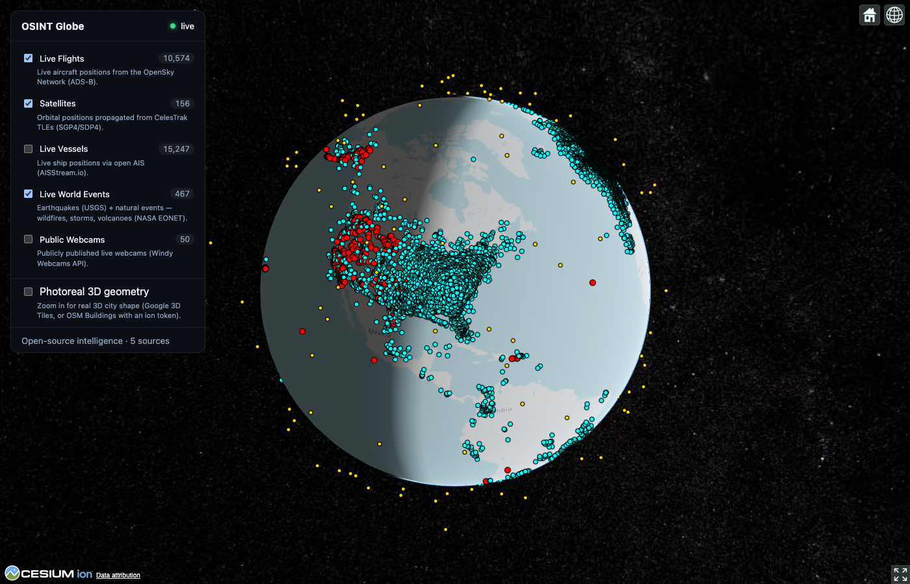

# OSINT Globe



Status: early prototype.

A 3D Cesium globe that shows openly published geospatial data: live flights,
satellites, world events, and optionally ships and public webcams. A small
gateway polls each source and streams updates to the browser over WebSocket.

Only openly published data is used. The project does not scan for or surface
private or unsecured camera feeds, or any source that needs authentication
bypassed. See [`docs/ARCHITECTURE.md`](docs/ARCHITECTURE.md#data-source-policy).

## Layers

| Layer            | Source                                   | Key needed                          |
| ---------------- | ---------------------------------------- | ----------------------------------- |
| Flights          | OpenSky Network (ADS-B)                  | No (`OPENSKY_USER`/`PASS` raise limits) |
| Satellites       | CelesTrak TLEs, propagated with SGP4     | No                                  |
| World events     | USGS earthquakes, NASA EONET             | No                                  |
| Vessels          | AISStream.io                             | Yes, `AISSTREAM_KEY`                |
| Public webcams   | Windy Webcams API                        | Yes, `WINDY_WEBCAMS_KEY`            |
| Terrain, 3D buildings | Cesium ion                          | Yes, `VITE_CESIUM_ION_TOKEN`        |
| Photoreal 3D tiles | Google Photorealistic 3D Tiles         | Yes, `VITE_GOOGLE_3DTILES_KEY`      |

Without a Cesium ion token the globe falls back to OpenStreetMap imagery.

## Stack

- Frontend: React, Vite, CesiumJS (`apps/web`)
- Gateway: Fastify and WebSocket; polls connectors, diffs, streams (`apps/gateway`)
- Shared: TypeScript `Entity` / `LayerId` types (`packages/shared`)

## Quick start

Requires Node 22.9 or newer.

```bash
npm install
cp .env.example .env      # optional; fill in keys for the keyed layers
npm run dev               # gateway on :4000, web on :5173
```

Open http://localhost:5173. Flights, satellites and events load with no keys.
Both the gateway and the web app read the single `.env` at the repo root.

Run the pieces separately:

```bash
npm run dev:gateway
npm run dev:web
curl localhost:4000/api/health
curl localhost:4000/api/layers/flights | head
```

## Add a data source

Implement the `Connector` interface and register it. The REST API, WebSocket
stream and layer list pick it up automatically.

```ts
// apps/gateway/src/connectors/mything.ts
export const myConnector: Connector = {
  id: 'mything', layer: 'incidents', title: 'My Source', description: '…',
  refreshIntervalMs: 30_000,
  async poll(ctx) { /* fetch, return Entity[] */ return []; },
};
// then add it to apps/gateway/src/connectors/index.ts
```

The roadmap (street-level imagery, watchlists, persistence) is in
[`docs/ARCHITECTURE.md`](docs/ARCHITECTURE.md).

## License

MIT
